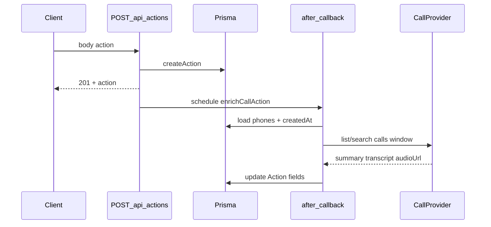

# Plan : enrichissement appel au moment de la sauvegarde d’une action

## Contexte actuel

- La création d’action passe par `[app/api/actions/route.ts](app/api/actions/route.ts)` : après validation + Mistral sur la note, `actionService.createAction(...)` puis `return successResponse(action, 201)`.
- Le modèle `[Action](prisma/schema.prisma)` (vers L763) n’a pas encore `summary` / `transcription` / URL audio dédiés à l’appel (hors `meetingPhone`, `duration`, `note`).
- Stack : **Next.js 16.1.1** ; `**libphonenumber-js`** déjà présent pour normaliser les numéros ; pas d’usage actuel de `after()` dans le repo.

## Flux cible




Comportement : **aucun webhook entrant** ; le CRM **interroge** le système qui détient appels / transcriptions / résumés (API sortante ou lecture d’une table interne si vous centralisez les logs ailleurs).

## 1. Schéma Prisma

Ajouter sur `Action` (noms à ajuster si vous préférez un préfixe `call*`) :

- `callSummary` `String?` `@db.Text`
- `callTranscription` `String?` `@db.Text`
- `callRecordingUrl` `String?` (URL signée ou permanente selon le provider)
- Option utile sans BullMQ : `callEnrichmentAt` `DateTime?` et/ou `callEnrichmentError` `String?` pour debug (court message)

Migration Prisma + `prisma generate`. Mettre à jour les `select`/`include` des routes qui renvoient le détail d’une action si l’UI doit afficher ces champs (ex. `[app/api/actions/[id]/route.ts](app/api/actions/[id]/route.ts)`, listes drawer).

## 2. Module métier isolé

Créer p.ex. `[lib/call-enrichment/enrich-action.ts](lib/call-enrichment/enrich-action.ts)` :

- `**normalizePhoneForMatch(e164Like)`** : réutiliser `libphonenumber-js` (défaut FR ou pays depuis env).
- `**collectCandidatePhones(action)**` : charger contact + company (`contact.phone`, `company.phone`, champs additionnels si le schéma les a) ; dédupliquer.
- `**matchCallInWindow({ phones, sdrId, createdAt, }, config)**` : délégué au **provider** (ci-dessous). Fenêtre : p.ex. `createdAt - 5min` → `createdAt + 1min` + ajustement si `duration` présent (configurable via `process.env`).

Créer `[lib/call-enrichment/provider.ts](lib/call-enrichment/provider.ts)` :

- Interface `fetchMatchingCallRecord(input): Promise<{ summary?, transcription?, recordingUrl? } | null>`
- **Implémentation initiale** : `NoOpProvider` (retourne `null` si env désactivé) ou stub qui log, pour ne pas bloquer le merge tant que le REST réel n’est pas branché.

Branchement réel : une seconde implémentation (fichier séparé) qui appelle **votre** API téléphonie avec auth par clé serveur ; pas de BullMQ.

## 3. Fire-and-forget dans `POST /api/actions`

Dans `[app/api/actions/route.ts](app/api/actions/route.ts)`, après succès de `createAction` et **avant** le `return` :

1. Importer `after` depuis `[next/server](https://nextjs.org/docs/app/api-reference/functions/after)` (API supportée sur App Router Next 15+ / 16).
2. Si `data.channel === 'CALL'` (et éventuellement feature flag `CALL_ENRICHMENT_ENABLED`), appeler :

```ts
after(() =>
  enrichActionFromCallProvider(action.id).catch((err) => {
    console.error("[call-enrichment]", action.id, err);
  })
);
```

1. Ne pas `await` ce travail : la réponse HTTP reste immédiate.

`enrichActionFromCallProvider` :

- Recharge l’`Action` + relations nécessaires.
- Si les colonnes sont déjà remplies, noop (idempotent).
- Appelle le provider ; si match → `prisma.action.update({ where: { id }, data: { ... } })`.

**Sécurité** : tokens provider uniquement côté serveur (`process.env`).

## 4. Idempotence et échecs

- Si aucun match : ne pas écraser des champs existants ; optionnellement stocker `callEnrichmentError = 'NO_MATCH'` une seule fois.
- Si erreur réseau : log + message court en base (éviter stack traces en prod).
- Pas de webhook : pour les cas où l’API téléphonie n’a pas encore l’enregistrement à `T+0`, documenter une **étape 2** (cron ou bouton « Resync ») — hors scope strict de ce plan si vous ne l’ordonnez pas maintenant.

## 5. Tests manuels

- Action `channel: EMAIL` → ne doit pas lancer d’enrichissement.
- Action `CALL` avec env désactivé → 201 OK, pas de crash `after`.
- Action `CALL` avec provider mock retournant un objet → colonnes mises à jour après quelques secondes (vérifier en base ou GET action).

## Fichiers principaux touchés


| Fichier                                                          | Rôle                                                                                               |
| ---------------------------------------------------------------- | -------------------------------------------------------------------------------------------------- |
| `[prisma/schema.prisma](prisma/schema.prisma)`                   | Nouveaux champs `Action`                                                                           |
| `[app/api/actions/route.ts](app/api/actions/route.ts)`           | `after(() => enrich...)`                                                                           |
| `lib/call-enrichment/*.ts`                                       | Normalisation, orchestration, interface provider                                                   |
| `[lib/services/ActionService.ts](lib/services/ActionService.ts)` | Optionnel : exposer une méthode `updateCallEnrichment` si vous évitez Prisma direct dans le module |
| `[app/api/actions/[id]/route.ts](app/api/actions/[id]/route.ts)` | Exposer les nouveaux champs en GET/PATCH si besoin UI                                              |


## Prérequis produit (à verrouiller avec vous)

- **Quelle source d’appels** (nom du produit + doc API) pour remplir summary / transcription / URL ?
- Fenêtre temporelle cible (minutes avant/après `createdAt`) et critère de désambiguïguation si plusieurs appels matchent.

Sans ces deux points, le plan reste implémentable avec un **provider no-op** et des colonnes prêtes pour brancher le client REST ensuite.