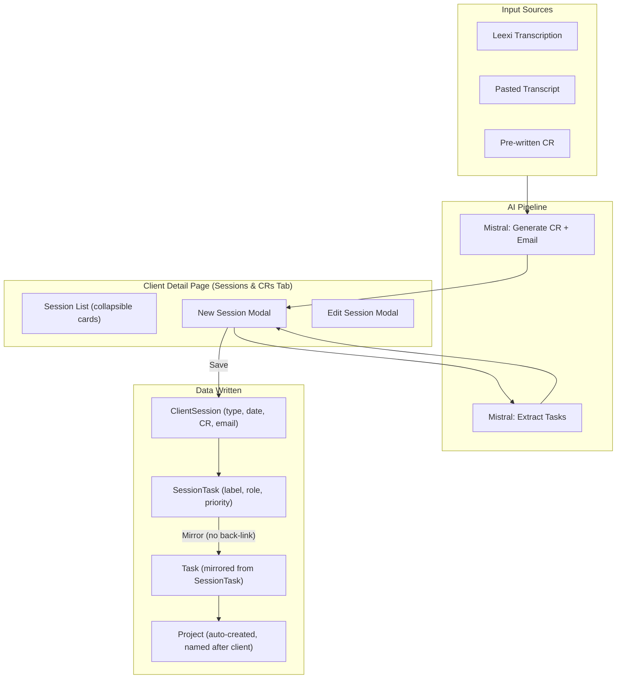

# Session, CR & Task Module — Product Design Enhancements

## Current Architecture

## Deep Analysis — Issues Found

### A. CR Module Issues

1. **CR displayed as `<pre>` not rendered markdown** — In `[app/manager/clients/[id]/page.tsx](app/manager/clients/[id]/page.tsx)` lines 1842-1845, the CR is wrapped in `<pre>` tags. Since it's generated as markdown (with `#`, `##`, `###` headers, bullet lists, bold), it should be rendered as HTML.
2. **Shared `showCRTab` state across sessions** — Line 366: one `showCRTab` state is shared across all expanded session cards. Expanding Session A on "email" tab, then expanding Session B, shows B's email tab too. This should be per-session.
3. `**emailSentAt` display is commented out** — Lines 1878-1881: The sent status indicator is commented out, so users can never see if an email was actually sent.
4. **No markdown preview in edit modal** — The edit modal uses raw `<textarea>` for CR editing with no preview toggle.

### B. Session Module Issues

1. **No search/filter/sort on sessions** — The session list has no way to filter by type, date range, or search CR content. For clients with many sessions, this is unusable.
2. **No session timeline visualization** — Sessions are flat cards. A timeline view showing session progression (Kick-Off -> Onboarding -> Validation -> Reporting -> Suivi) would give managers visual context.
3. **Delete uses `window.confirm()`** — Line 1787: Native browser confirm dialog instead of the existing `ConfirmModal` component.
4. **No session status/outcome** — Sessions have no "outcome" field (successful, needs follow-up, blocked). All sessions look the same.

### C. Task Auto-Creation Flow Issues (Critical)

1. **Task-to-Project mirroring has no back-link** — In `[app/api/clients/[id]/sessions/route.ts](app/api/clients/[id]/sessions/route.ts)` lines 146-162: Session tasks are mirrored to project tasks via `createMany`, but there's no `sessionTaskId` field linking them back. Changes in one system don't propagate to the other.
2. **Auto-created project has no members** — Line 134-143: The auto-created project only has the `ownerId` set. No `ProjectMember` record is created, so the creator isn't even added as a member. Other team members (SDRs, devs) assigned to tasks are not added.
3. **No user feedback about project creation** — When tasks are saved and a project is auto-created, the UI shows "Session enregistrée" but says nothing about the project. The user has no idea a project was created or where to find it.
4. **Duplicate project names possible** — The `findFirst` on line 126 uses `{ clientId, name: client.name }` but doesn't filter by `status: 'ACTIVE'`. An archived project with the same name would be reused.
5. **Task assignee is free-text, not a user reference** — In `[components/sessions/AITaskExtractor.tsx](components/sessions/AITaskExtractor.tsx)` line 295-301: The assignee field is a plain text input. When mirrored to project tasks, the `assigneeId` is never set because there's no user lookup.
6. **Mirrored tasks have no due date** — Session tasks have no `dueDate` concept. Mirrored project tasks inherit no deadline, making them harder to track.
7. **No task completion sync** — Marking a `SessionTask` as done doesn't update the mirrored `Task`, and vice versa.

### D. Manager Perspective Issues

1. **No "view project" link from session** — After saving a session with tasks, there's no link to navigate to the auto-created project.
2. **No session KPIs in client overview** — The overview tab doesn't show session stats (total sessions, last session date, open tasks from sessions).

---

## Proposed Enhancements (Prioritized)

### P0 — Critical Fixes

| #   | Enhancement                                                                                                                                    | Files                                                                         |
| --- | ---------------------------------------------------------------------------------------------------------------------------------------------- | ----------------------------------------------------------------------------- |
| 1   | **Render CR as markdown** — Replace `<pre>` with a markdown renderer (`react-markdown` or `@next/mdx`). Apply prose styling.                   | `app/manager/clients/[id]/page.tsx`                                           |
| 2   | **Fix shared `showCRTab` state** — Move to per-session state using `expandedSessionId` + a `Record<string, 'cr'                                | 'email'>` map.                                                                |
| 3   | **Fix auto-created project missing member** — Add `ProjectMember` creation for the owner. Add status filter `status: 'ACTIVE'` to `findFirst`. | `app/api/clients/[id]/sessions/route.ts`                                      |
| 4   | **Show project creation toast** — After session save, if tasks were created, show a toast with a "View project" link.                          | `app/api/clients/[id]/sessions/route.ts`, `app/manager/clients/[id]/page.tsx` |
| 5   | **Unhide emailSentAt indicator** — Uncomment and implement the email sent status display.                                                      | `app/manager/clients/[id]/page.tsx`                                           |

### P1 — High-Impact UX

| #   | Enhancement                                                                                                                                                           | Files                                                                               |
| --- | --------------------------------------------------------------------------------------------------------------------------------------------------------------------- | ----------------------------------------------------------------------------------- |
| 6   | **Replace free-text assignee with user selector** — Fetch team members and show a dropdown in `AITaskExtractor`. Map to `assigneeId` when mirroring to project tasks. | `components/sessions/AITaskExtractor.tsx`, `app/api/clients/[id]/sessions/route.ts` |
| 7   | **Add due date picker to extracted tasks** — Add optional `dueDate` field to `SessionTask` schema and `AITaskExtractor`. Pass through to mirrored project tasks.      | `prisma/schema.prisma`, `components/sessions/AITaskExtractor.tsx`, API routes       |
| 8   | **Add "View Project" link in session card** — When a session has tasks, show a link to the associated project. Return `projectId` in the session creation response.   | `app/api/clients/[id]/sessions/route.ts`, `app/manager/clients/[id]/page.tsx`       |
| 9   | **Replace `window.confirm` with `ConfirmModal`** — Use the existing design system component for delete confirmation.                                                  | `app/manager/clients/[id]/page.tsx`                                                 |
| 10  | **Add session search and type filter** — Add a search bar + type filter chips above the session list.                                                                 | `app/manager/clients/[id]/page.tsx`                                                 |

### P2 — Product Refinements

| #   | Enhancement                                                                                                                                          | Files                                                                                     |
| --- | ---------------------------------------------------------------------------------------------------------------------------------------------------- | ----------------------------------------------------------------------------------------- |
| 11  | **Add session KPI strip to overview tab** — Show total sessions, last session date, open session tasks count as stat cards.                          | `app/manager/clients/[id]/page.tsx`                                                       |
| 12  | **Add task completion toggle in session view** — Allow marking tasks done/undone directly from the expanded session card via PATCH on `SessionTask`. | `app/api/clients/[id]/sessions/[sessionId]/route.ts`, `app/manager/clients/[id]/page.tsx` |
| 13  | **Add markdown preview toggle in edit modal** — Toggle between raw editor and rendered preview when editing a CR.                                    | `app/manager/clients/[id]/page.tsx`                                                       |
| 14  | **Session timeline mini-view** — Add a horizontal timeline showing session types chronologically at the top of the sessions tab.                     | `app/manager/clients/[id]/page.tsx`                                                       |
| 15  | **Link `SessionTask` to `Task`** — Add `taskId` foreign key on `SessionTask` pointing to the mirrored `Task`. Enable bidirectional status sync.      | `prisma/schema.prisma`, `app/api/clients/[id]/sessions/route.ts`                          |

---

## Key Files to Modify

- `**[app/manager/clients/[id]/page.tsx](app/manager/clients/[id]/page.tsx)**` (~3000 lines) — Main client detail page with Sessions & CRs tab
- `**[app/api/clients/[id]/sessions/route.ts](app/api/clients/[id]/sessions/route.ts)**` — Session creation API with task-to-project mirroring
- `**[app/api/clients/[id]/sessions/[sessionId]/route.ts](app/api/clients/[id]/sessions/[sessionId]/route.ts)**` — Session update/delete API
- `**[components/sessions/AITaskExtractor.tsx](components/sessions/AITaskExtractor.tsx)**` — AI task extraction component
- `**[prisma/schema.prisma](prisma/schema.prisma)**` — Data model (SessionTask additions)

## Implementation Notes

- The auto-project-creation logic already exists at lines 121-163 of `app/api/clients/[id]/sessions/route.ts`. The task is to **fix and enhance** it, not build from scratch.
- The `designsystem.txt` file referenced in user rules does not exist in the repo. Design patterns should be derived from existing pages: indigo/violet gradients, rounded-xl, slate palette, consistent with `components/ui/`.
- The `react-markdown` package (or `marked`) will need to be added as a dependency for CR rendering.

